# DDD Diagram Set

This document collects the common DDD diagram types used to describe the workflow automation platform. It combines strategic design views, tactical design views, state models, collaboration flows, and the full domain-event surface.

## Included Diagram Types

- strategic subdomain landscape
- strategic context map
- aggregate landscape
- definition-context domain model view
- execution-context domain model view
- aggregate state models
- collaboration sequence diagrams
- comprehensive domain event topology

## Strategic Subdomain Landscape

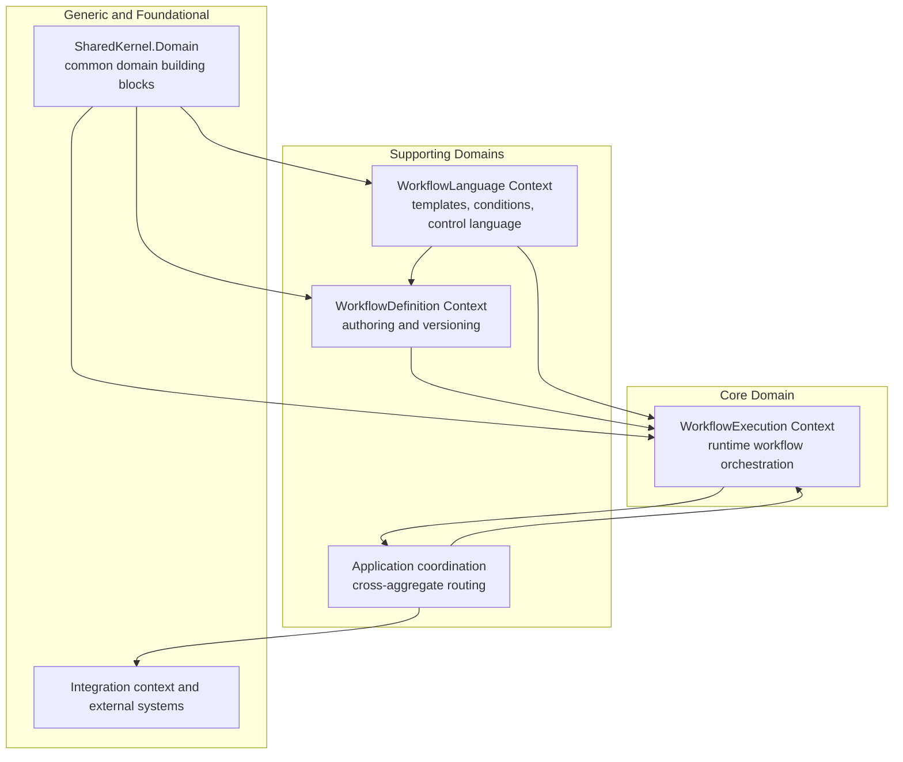

## Strategic Context Map

```mermaid
flowchart LR
    USER["Users and operators"]

    subgraph SK["Shared Kernel"]
        SKN["WorkflowAutomation.SharedKernel.Domain<br/>AggregateRoot, Entity, ValueObject,<br/>IRepository, strongly typed IDs"]
    end

    subgraph LANG["Workflow Language Context"]
        WL["WorkflowAutomation.WorkflowLanguage.Domain<br/>FailureStrategy, ConcurrencyMode,<br/>IterationFailureStrategy,<br/>TemplateResolver, ConditionEvaluator"]
    end

    subgraph DEF["Workflow Definition Context"]
        WD["WorkflowAutomation.WorkflowDefinition.Domain<br/>Workflow, WorkflowDefinition, WorkSpace,<br/>Integration metadata, step definitions,<br/>authoring validation and versioning"]
    end

    subgraph EXEC["Workflow Execution Context"]
        WE["WorkflowAutomation.WorkflowExecution.Domain<br/>WorkflowExecution, ActionExecution,<br/>LoopExecution, StepExecution,<br/>WorkflowDefinitionSnapshot"]
    end

    subgraph APP["Application Coordination (assumed)"]
        APPN["Handlers and process managers<br/>persist aggregates, route events,<br/>spawn child workflows, cancel correlated children,<br/>schedule retries, observe deadlines"]
    end

    subgraph INT["Integration Context and External Systems"]
        INTN["Integration gateway, rate limiting,<br/>auth and token lifecycle, external APIs"]
    end

    USER -->|authors workflows| WD
    SKN -->|shared kernel| WL
    SKN -->|shared kernel| WD
    SKN -->|shared kernel| WE
    WL -->|templates, conditions, enums| WD
    WL -->|templates, conditions, enums| WE
    WD -->|supplies immutable workflow version snapshots| WE
    WE -->|domain events| APPN
    APPN -->|commands and persistence| WE
    APPN -->|dispatch integration requests| INTN
    INTN -->|success and failure outcomes| APPN
```

## Relationship Notes

- `WorkflowAutomation.SharedKernel.Domain` is the actual shared kernel. `WorkflowAutomation.WorkflowLanguage.Domain` is a separate supporting context consumed by both design-time and runtime contexts.
- `WorkflowAutomation.WorkflowDefinition.Domain` is upstream of `WorkflowAutomation.WorkflowExecution.Domain` through immutable workflow version snapshots rather than direct reuse of mutable authoring aggregates.
- `WorkflowAutomation.WorkflowExecution.Domain` contains three cooperating runtime aggregates: `WorkflowExecution`, `ActionExecution`, and `LoopExecution`.
- Application coordination is not itself a bounded context, but it is the seam where cross-aggregate routing happens.
- Integration concerns such as throttling, token lifecycle, and external transport remain outside the domain layer.

## Aggregate Landscape

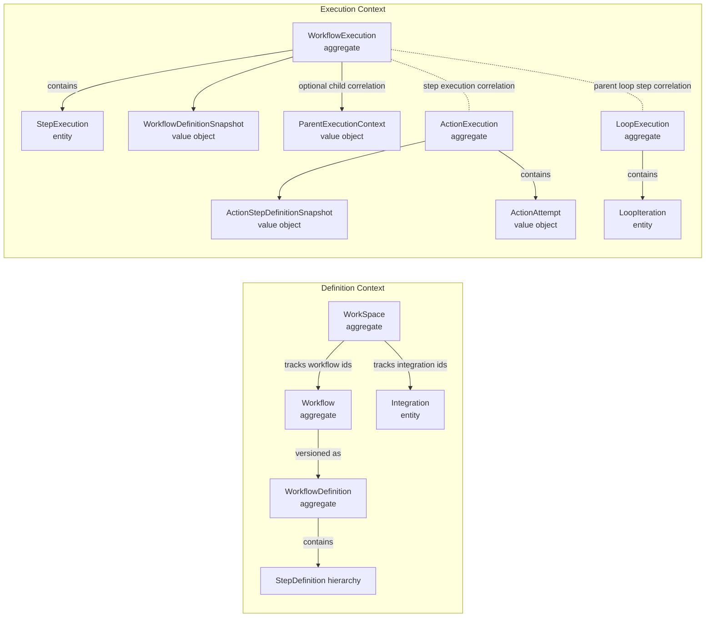

## WorkflowDefinition Domain Model View

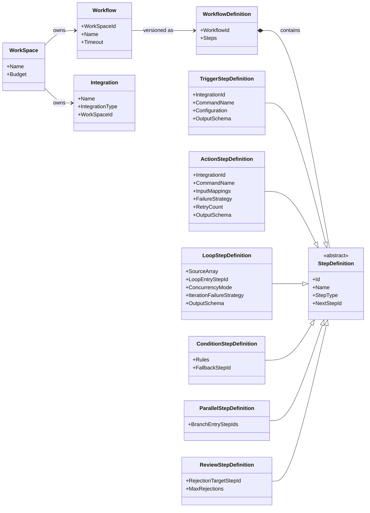

## WorkflowExecution Domain Model View

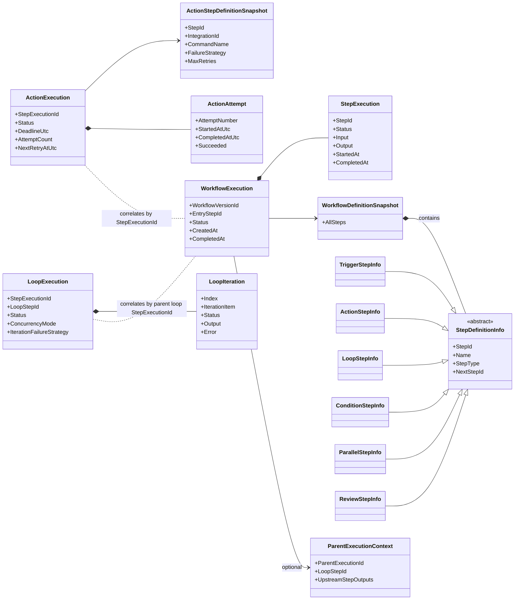

## Aggregate State Models

### WorkflowExecution State Model

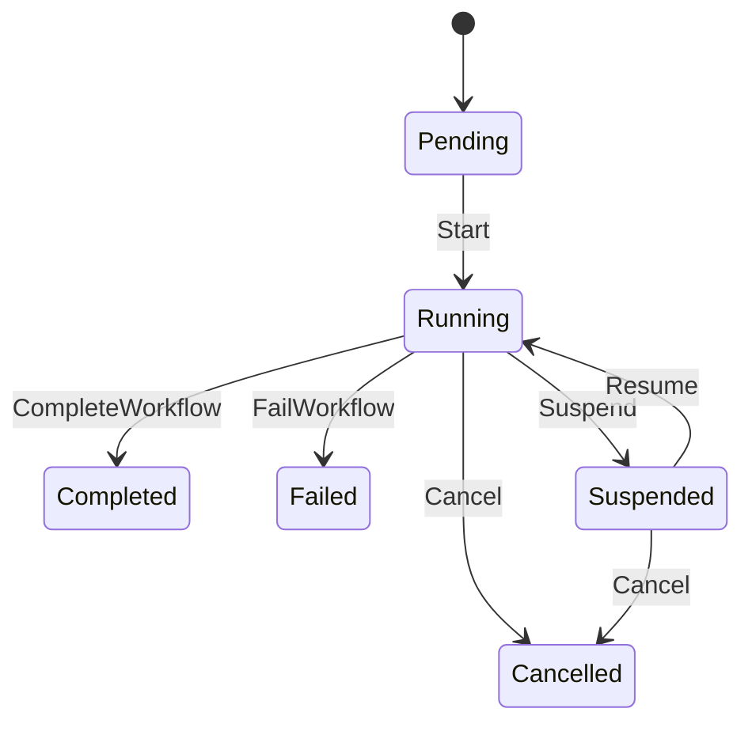

### ActionExecution State Model

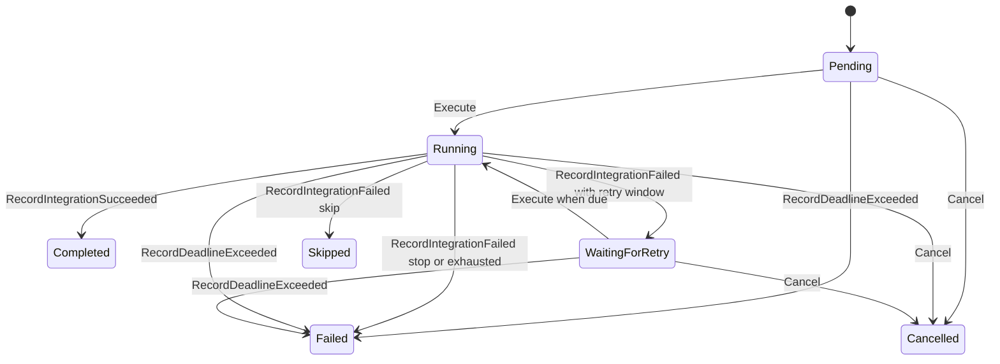

### LoopExecution State Model

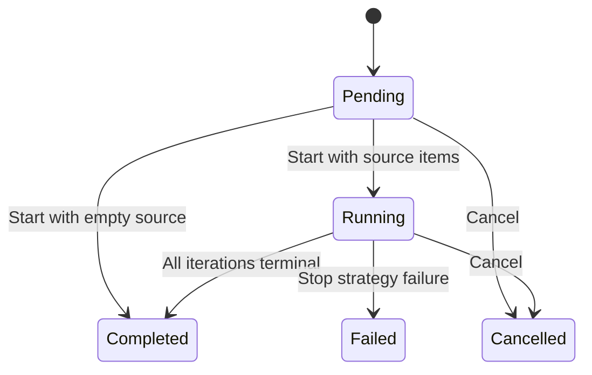

## Collaboration Sequence Diagrams

### Action Step Coordination

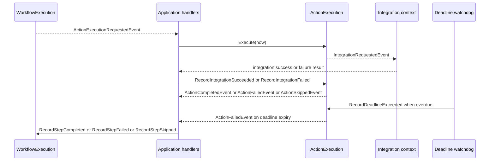

### Loop Step Coordination

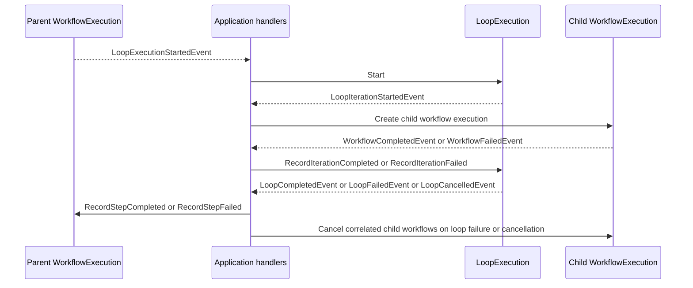

## Comprehensive Domain Event Topology

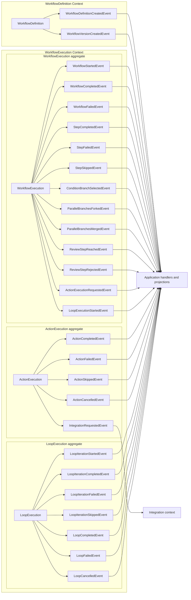

This topology is intentionally event-focused. Commands such as `Execute`, `Start`, `RecordIntegrationSucceeded`, `RecordIterationCompleted`, and `RecordStepCompleted` are omitted so the full event surface remains readable.

## Ownership Summary

| Context | Main model | Owns decisions about |
| --- | --- | --- |
| SharedKernel.Domain | `AggregateRoot`, `Entity`, `ValueObject`, `IRepository`, IDs | shared domain building blocks |
| WorkflowLanguage.Domain | enums, template resolution, condition evaluation | expression and control-language semantics |
| WorkflowDefinition.Domain | `Workflow`, `WorkflowDefinition`, step definitions, output schemas | authoring-time validity, versioning, allowed references |
| WorkflowExecution.Domain | `WorkflowExecution`, `ActionExecution`, `LoopExecution`, `StepExecution` | runtime progression, retries, deadline state, loop policy |
| Application coordination | handlers and process managers | cross-aggregate routing, child-workflow correlation, deadline observation |
| Integration and external systems | gateways and provider adapters | transport, rate limiting, auth, external API interaction |

## Current Architectural Decisions

- Action timeout is modeled as overall deadline expiry. The domain aggregate owns `DeadlineUtc` and terminal expiry through `RecordDeadlineExceeded`, while application services or watchdogs decide when to invoke it.
- `LoopExecution` owns loop policy, but application handlers own child-workflow correlation and cancellation after terminal loop events.
- `WorkflowExecution` remains the graph orchestrator. It delegates action-step policy to `ActionExecution` and loop-step policy to `LoopExecution`.
